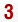
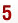
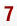
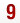
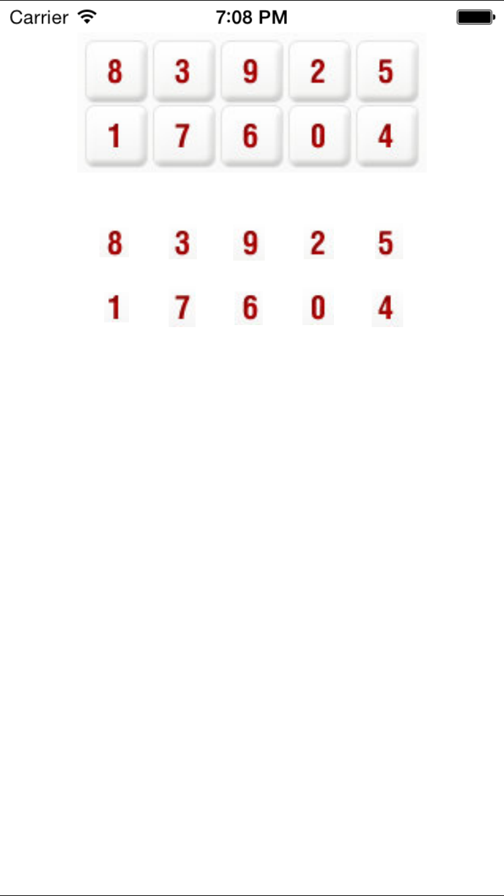

## My other works

[http://leverdeterre.github.io] (http://leverdeterre.github.io)

# JMImageScanning

[](https://travis-ci.org/Jerome Morissard/JMImageScanning)
[](http://cocoapods.org/pods/JMImageScanning)
[](http://cocoapods.org/pods/JMImageScanning)
[](http://cocoapods.org/pods/JMImageScanning)


## What is it for ?
Scanning image to find sub image, like a CIDetector but to detect targeted images.

## Really? but what is it for ?
I'm working on a lot of Bank applications and in order to execute functional testing i fix the constraint of logging on real testing accounts (protected by secure keyboard) using this library.

The idea, i have a master image (here, a secure keyboard to analyse). 


I want to find a sub image (here, all the pieces of the keyboard).










I am running pixel scanning on the targeted keyboard for each pieces.

## The result :)


## Installation

JMImageScanning is available through [CocoaPods](http://cocoapods.org). To install
it, simply add the following line to your Podfile:

```ruby
pod "JMImageScanning"
```

```objc
UIImage *keyboardImage = [UIImage imageNamed:@"free.png"];
UIImage *image = [UIImage @"free-0.png"];
NSArray *points = [keyboardImage findPositionsOfSubImage:image];

NSError *error;
CGPoint p = [keyboardImage findFirstPositionOfSubImage:image treshold:0.70f error:&error];
```

## TODO
- [x] increase performance on device (V0.2 increase 42% of performance)
- [ ] support heterogeneous scales

## Performances
iPhone 5 (iOS8.4), 100 run

|  Version  | search time (ms) | 
| ------------- |:-------------:| 
|  V0.1  | 620ms | 
|  V0.2  | 359ms | 
|  develop  | 156ms | 


## Author

Jerome Morissard, morissardj@gmail.com

## License

JMImageScanning is available under the MIT license. See the LICENSE file for more info.
